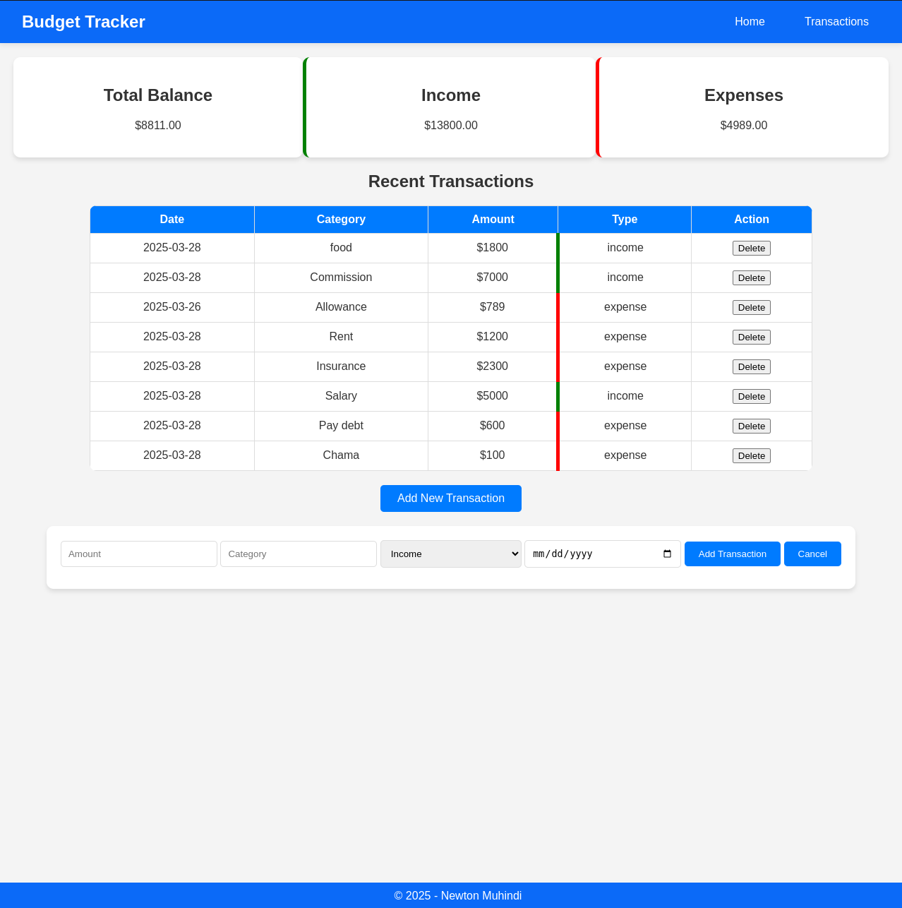
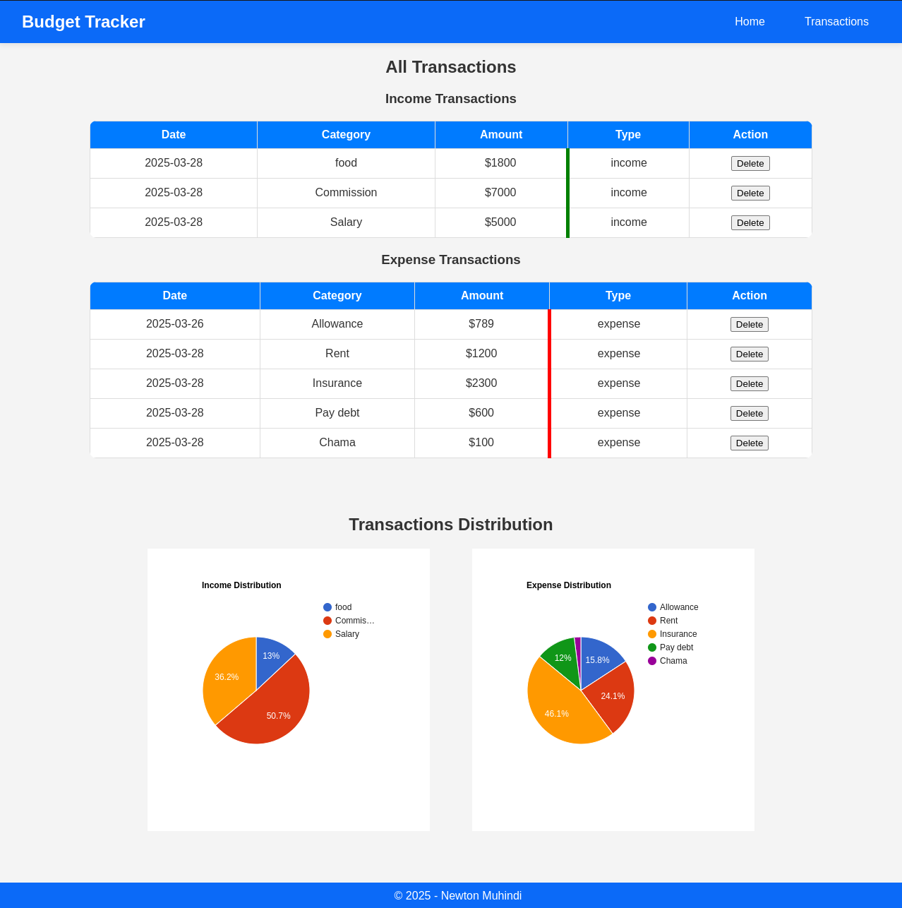

# Smart Budget Tracker

## Overview

Smart Budget Tracker is a user-friendly budgeting Single Page Application (SPA) designed to help individuals and small businesses efficiently track their income and expenses. The app provides real-time insights into spending habits, ensuring better financial management through visual analytics and transaction tracking. It utilizes `json-server` for local data storage and asynchronously updates records to ensure a smooth user experience without page reloads.

## Features

- **Navigation Bar:** Minimalist design with links to Home and Transactions.
- **Dashboard (Home Page):** Displays total balance, income, expenses, and a summary of the last few transactions. Includes a button to add a new transaction.
- **Transactions Page:** Lists all transactions with details such as date, category, amount, and type (Income/Expense). Features a filter/search bar and edit/delete buttons.
- **Add/delete Transaction Form:**
  - Fields: Amount, Category (Food, Transport, Bills, etc.), Type (Income/Expense), Date, and Description.
  - Submit and cancel buttons.
- **Budget Overview:** Displays pie charts showing income and expense distribution.

## Technologies Used

- **Frontend:** HTML, CSS, JavaScript
- **Backend:** JSON Server (for local data storage and API simulation)
- **Visualization:** Chart.js (for rendering financial insights)

## Installation

### Prerequisites

Ensure you have the following installed on your system:

- [Node.js](https://nodejs.org/)
- npm (comes with Node.js)

### Setup Instructions

1. Clone the repository:
   ```sh
   git clone https://github.com/muhindinewton/Phase-1-Smart-Budget-Tracker-Project.git
   ```
2. Navigate to the project directory:
   ```sh
   cd smart-budget-tracker
   ```
3. Install dependencies:
   ```sh
   npm install
   ```
4. Start the JSON Server to handle transactions:
   ```sh
   json-server --watch db.json
   ```
5. Open `index.html` in your preferred web browser.

## Screenshots

### Dashboard Page


### Transactions Page



## License

This project is licensed under the **MIT License**.

## Author

Developed by **Newton Muhindi**, a passionate web developer specializing in HTML, CSS, and JavaScript.


